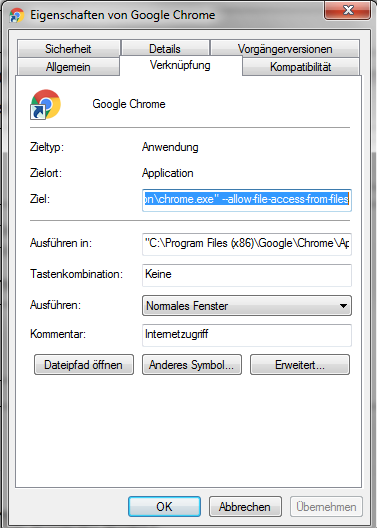

# Simulation of an AAL (Ambient Assisted Living) system

This simulation was developed for the presentation as a visual simulation during final project of the class "FOS-17-a", group "A1"
at the school "Regionales Bildungszentrum Technik Kiel" (RBZ-Technik Kiel).

* Please follow the following instructions to ensure a correct workflow.
* Also keep this file updated for your own good.
* A live demo can be found at [julian-wittorf.de/fos17a/](http://julian-wittorf.de/fos17a/), the source code is available on [GitHub](https://github.com/jwittorf/fos-17-a-project-ambient-assisted-living-aal-visual-simulation).

---------------------------------------


## Technical requirements

* Modern webbrowser
	* Tested under Google Chrome 63.0.3239.132.
	* Since this is an offline and one-time presentation/simulation, there are no intentions to support more than one browser. This saves development time and reduces the load of needed resources and therefore increases the performance.
* (Local) webserver
	* Tested under Apache 2.4.27.
	* If you don't have a webserver, you can also access the file directly inside your browser via the `file:` protocol.
		* Depending on your browser it might work out of the box (e.g. Firefox Developer Edition), for Google Chrome you need to add `"--allow-file-access-from-files` to the launch options/target like this:
		
	* If you intend to contribute, you need to have [Node.js](https://nodejs.org/) installed in a minimum version of `4.0.0`.
	`npm` is used for providing and updating asset-dependencies like jquery.
* JavaScript needs to be enabled
* Please browse the simulation in a common desktop computer resolution, although it uses responsive breakpoints,
there is no optimization or so ever for mobile or small devices. This simulation is intended to run on a high resolution projector.


## Features/requirements and how to implement them

### Default toggles
Define toggles to be active by default for e.g. devices needing constant electricity

#### What you need:
* Add the id of the toggle's `data-target` to the `defaultTogglesOn` array

#### Example:
```js
defaultTogglesOn = [
    "#kitchen-fridge-control-signal-one",
    "#kitchen-freezer-control-signal-one"
];
```

---------------------------------------


### Exclude toggles from global reset
Define toggles not to be reset by the global reset button, e.g. devices needing constant electricity

#### What you need:
* Add the id of the toggle's `data-target` to the `globalControlResetExclude` array

#### Example:
```js
globalControlResetExclude = [
    "#kitchen-fridge-control-signal-one",
    "#kitchen-freezer-control-signal-one"
];
```

---------------------------------------


### Global station
Shows if at least one toggle is active in the specified section

#### What you need:
* On all new `toggle-local-control` elements make sure to follow the markup and add a correct `data-group`, the `data-target` and the `data-name` (see [Check on front door lock](#check-on-front-door-lock)).
	* The `data-group` needs to be the same in the entire section!
		* Make sure to set the correct id for the `.hallway-station-lamp`, corresponding to the `data-group`
	* For windows, make sure to add the class `window-control` (defined also as `windowControlClass` in `jquery.main.js`)
	* For emergency toggles, not need to add anything else, they use the `emergencyMessages` array
* That's it, the script will take care of everything else.

#### Example:
```html
<div
class="toggle toggle-light toggle-local-control kitchen-stove-control"
id="kitchen-stove-control-hotplate-one"
data-name="#kitchen-window-name"
data-target="#kitchen-stove-hotplate-one"
data-group="station-group-kitchen"></div>
```

---------------------------------------


### Emergency toggle
* In every section should be an emergency toggle.
* Activating it opens a modal (popup) with a warning message and activates the station lamp.
* After closing the modal
	* The area starts to blink
	* An entry is added to the log area
* If a different emergency toggle is triggered, the message from the toggle before will still show up in the modal!
* To remove the blinking and the "old" messages from the modal, just disable to activated toggle.
	* There will also be a new entry in the log, claiming the emergency has been resolved.
* After resolving all emergencies, the station lamp goes inactive again

#### What you need:
* wrapping class: `[section]-emergency-content emergency-content`
* wrapping id for name/heading: `[section]-emergency-name`
* `toggle` element with
	* class: additional `toggle-local-emergency` 
	* id: `[section]-emergency` 
	* data-name: referring to id from name/heading (2.)
	* data-target: referring to id from content (`[section]-content`) 

#### Example:
```html
<div class="kitchen-emergency-content emergency-content">
    <div class="row">
        <div class="col-xs-7">
            <div id="kitchen-emergency-name">
                Not-Taster Küche
            </div>
        </div>
        <div class="col-xs-5">
            <div class="toggle toggle-light toggle-local-emergency"
                 id="kitchen-emergency" data-name="#kitchen-emergency-name"
                 data-target="#kitchen-content"></div>
        </div>
    </div>
</div>
```

---------------------------------------


### Check on front door lock
If you try to lock the front door, there is a check for any not excluded devices beeing active.
A modal popup will appear and tell you what devices need to be set inactive before you can close the door.

#### What you need:
* id for all devices names (`<h4>`): `[section]-[device]-name`
* data-name: `#[section-device-name]`

#### Example:
```html
<h4 id="kitchen-window-name">Fenster</h4>
<!-- ... -->
<div
	class="toggle toggle-light toggle-local-control kitchen-window-control window-control"
	id="kitchen-window-control-signal-one"
	data-name="#kitchen-window-name"
	data-target="#kitchen-window-signal-one"
	data-group="station-group-kitchen"></div>
```

---------------------------------------


### Global timer

Simulates a morning (wake-up) and a night (sleep).
During night until morning all possible local control toggles (devices, aka globalTimerToggles) will be set to disabled an inactive.
This refers to all local control toggles, that are NOT excluded from the global reset. What is excluded from global reset will not be disabled and set inactive.

#### How it works
* On activation all possible local control toggles (devices, aka globalTimerToggles) will be set inactive and disabled (simulate the night).
* After the start time, all globalTimerToggles will be enabled again, so you can set them active (simulate the day).
* The stop time determines after what time in seconds AFTER THE START TIME the globalTimerToggles will again be set inactive and disabled (simulate the night).
* After going back to night mode, the checkbox for enabling the timer will be enabled again.
	* Uncheck it to enable the globalTimerToggles again, so you can set them active or inactive for further simulation.

#### Use it like this
* Set a start time in seconds (time from initial night to morning, since we start at night)
* Set a stop time in seconds (time from set morning to night, aka duration of the day)
	* Will be added on top of the start time,
	so if you have 5 seconds start and 10 seconds stop,
	the action will happen 10 seconds after enabling the globalTimerToggles
* Reload the browser by yourself or use the refresh button on the right

---------------------------------------


## Developer and author

* Julian Wittorf (FOS-17-a @ RBZ-Technik Kiel)
	* E-Mail: [<jwittorf@die-netzwerkstatt.de>](mailto:jwittorf@die-netzwerkstatt.de)

---------------------------------------


## Contributors

* Phillip Beeck (FOS-17-a @ RBZ-Technik Kiel)
	* E-Mail: [<pb151092@gmail.com>](mailto:pb151092@gmail.com)
* Tobias Eichler (FOS-17-a @ RBZ-Technik Kiel)
	* E-Mail: [<tobiaseichle@gmail.com>](mailto:tobiaseichle@gmail.com)

---------------------------------------


## License and Copyright

Copyright © Phillip Beeck [<pb151092@gmail.com>](mailto:pb151092@gmail.com), Tobias Eichler [<tobiaseichle@gmail.com>](mailto:tobiaseichle@gmail.com), Julian Wittorf [<jwittorf@die-netzwerkstatt.de>](mailto:jwittorf@die-netzwerkstatt.de)

This work is licensed under a [Creative Commons Attribution-ShareALike 4.0 International License](http://creativecommons.org/licenses/by-sa/4.0/). See the LICENSE file for more details.
You are free to share (copy and redistribute the material in any medium or format) and adapt (remix, transform, and build upon the material for any purpose, even commercially.).
Under the following terms:
* Attribution - You must give appropriate credit, provide a link to the license, and indicate if changes were made. You may do so in any reasonable manner, but not in any way that suggests the licensor endorses you or your use.
* ShareALike - If you remix, transform, or build upon the material, you must distribute your contributions under the same license as the original.
* No additional restrictions - You may not apply legal terms or technological measures that legally restrict other from doing anything the license permits.

---------------------------------------


## Special thanks

We like to thank the [Stadtwerke Kiel](https://www.stadtwerke-kiel.de) for letting us use their facility and materials for our project.
Shout out to our supervisor Mr. Kayser for checking on us every now and then.
